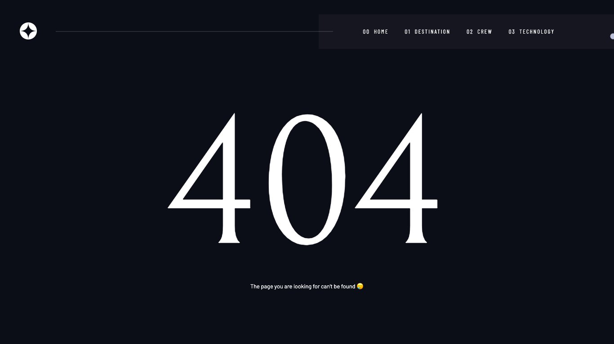

# Frontend Mentor - Space tourism website solution

This is a solution to the [Space tourism website challenge on Frontend Mentor](https://www.frontendmentor.io/challenges/space-tourism-multipage-website-gRWj1URZ3). Frontend Mentor challenges help you improve your coding skills by building realistic projects. 

## Table of contents

- [Overview](#overview)
  - [The challenge](#the-challenge)
  - [Screenshot](#screenshot)
  - [Links](#links)
- [My process](#my-process)
  - [Built with](#built-with)
  - [What I learned](#what-i-learned)
  - [Continued development](#continued-development)
  - [Useful resources](#useful-resources)
- [Author](#author)
- [Acknowledgments](#acknowledgments)

## Overview

### The challenge

Users should be able to:

- View the optimal layout for each of the website's pages depending on their device's screen size
- See hover states for all interactive éléments on the page
- View each page and be able to toggle between the tabs to see new information

### Screenshot

 
 




### Links

- Solution URL: [https://github.com/la2spaille/space.tourism](https://github.com/la2spaille/space.tourism)
- Live Site URL: [https://space-tourism-by-la2spaille.herokuapp.com/](https://space-tourism-by-la2spaille.000webhostapp.com/)

## My process

### Built with

- HTML
- CSS  
- JavaScript
- PHP 
- Sql DataBase
- Desktop-first workflow

### What I learned
(Cette paritie est obselète j'ai améliorer mon code depuis mais la logique reste la même)
Grace a ce projet j'ai appris de chose vraiment importante à mes yeux :
- Une propriété css permettant de definir la façon dont le contenu d'un élément doit se mélanger avec le contenu de l'élément parent et avec son arriére plan
```css
.class {
  mix-blend-mode: difference;
}
```
cela est uilisé sur le curseur.
- Les transiton entre les pages réalisé en Ajax
```js
// AJAX
const xhr = new XMLHttpRequest()  // On crée ici une instance de la class XMLHttpRequest
let cuts, select 
function transitionBefore() { // Cette fonction se déclanche lorsqu'on clique sur un lien
    loader.classList.remove('dom-loaded') // Le loader apparaît
    loader.classList.add('init') 
    setTimeout(() => {
        loader.classList.remove('init')
        loader.classList.add('transition') // Le logo et le nom du site s'animent
    }, 700);
}
function transitionAfter() {
    cuts = xhr.responseText.split('<main>') /* On récupère le DOM de la page appelé et on le découpe (l'astuce est que chaque page a une unique balise <main> sans attribut afin de récuperer le contenue de la page.) */
    cuts = cuts[1].split('</main>')
    select = cuts[0]
    // On termine la transition
    setTimeout(() => { // On attend que le loader soit en place
        document.querySelector("main").innerHTML = select // Contient le résultat de la page
        allImg = Array.from(document.querySelectorAll('img')) 
        isLoad = (currentValue) => currentValue.complete == true //Cette fonction test si une image est chargée
        let loadEvent = setInterval(() => { // Toutes les 0.5s on verifie si toutes les images sont chargées
            if(allImg.lenght !=0) {
                if (allImg.every(isLoad)) {
                clearInterval(loadEvent) // Les images sont chargées
                setTimeout(() => {
                    loader.classList.add('dom-loaded') // Le loader peut disparaître
                    // Reveal
                    reveal.forEach(reveal => {
                        setTimeout(() => {
                            reveal.classList.remove('transformation') /* Afin de faciliter les animation d'appariton lorsqu'un tombe sur une nouvelle page, je donne à tous mes élements la classe "transformation" pour les mettre dans des états définis ensuite lorque cette classe est retiré ils retriouvent leur aspects normaux. Les délai sont donc définis en css */
                            pageScript() // Ici on active le script propre à chaque page 
                        }, 800);
                    })
                }, 500);
                setTimeout(() => {
                    loader.classList.remove('transition')
                }, 1400);
                window.scrollTo(0, 0) //On réinitialise le scroll
                pageTransition()  /* On appelle cette fonction pour perdurer le cycle de ce script apres chaque transition */
                } 
            } else {
                clearInterval(loadEvent)
                    setTimeout(() => {
                        loader.classList.add('dom-loaded')
                        // Reveal
                        reveal.forEach(reveal => {
                            setTimeout(() => {
                                reveal.classList.remove('transformation')
                                pageScript()
                            }, 800);
                        })
                    }, 500);
                    setTimeout(() => {
                        loader.classList.remove('transition')
                    }, 1400);
                    window.scrollTo(0, 0) //On réinitialise le scroll
                    pageTransition()
            }
        }, 100);
    }, 1750);
}
let pageTransition = function () {
    let ajaxLinks = document.querySelectorAll('a') // On recupere tout les liens sachant qu'il sont tous interne 
    allImg = Array.from(document.querySelectorAll('img')) // On recupere toute les image 
    isLoad = (currentValue) => currentValue.complete == true // La fameuse fonction "isLoad"
    pageScript() 
    init() /* Dans cette fonction se retrouve le script permettant les effets de parallaxe, le fonctionnement du curseur,... */
    ajaxLinks.forEach(link => {
        link.addEventListener('click', (e) => {
            // Début de la transition (un lien est cliqué)
            transitionBefore()

            e.preventDefault()
            e.stopPropagation() // Annule le comportement habituel des liens
            xhr.onreadystatechange = function () {
                if (xhr.readyState === 4) {
                    if (xhr.status === 200) {
                        transitionAfter() // Le status est bon, la transition peut se terminer
                    } else {
                        console.log('Pas de chance') // Little joke en esperant que tt se opassera toujours bien 
                    }
                }
            }
            xhr.open('GET', e.target.getAttribute('href'), true) // On demande le fichier voulue
            xhr.setRequestHeader('X-Requested-With', 'xmlhttprequest') 
            xhr.send() //  On envoie le fichier 
            if (e.target.getAttribute('href') != window.location) { /* cette condition permet d'actualiser la barre d'url */
                window.history.pushState({ path: e.target.getAttribute('href') }, '', e.target.getAttribute('href'))
            }
        })

    })
}
pageTransition() // On appelle la fonction pour que tout s'exécute 
// Transition entre les pages avec les boutons de navigation du navigateur
window.addEventListener('popstate', () => {
    transitionBefore()
    xhr.onreadystatechange = function () {
        if (xhr.readyState === 4) {
            if (xhr.status === 200) {
                transitionAfter()
            } else {
                console.log("Pas bon, pas bon du tout...")
            }
        }
    }
    xhr.open('GET', window.location.href, true)
    xhr.setRequestHeader('X-Requested-With', 'xmlhttprequest')
    xhr.send()
})
```

### Continued development

Par la suite je compte en apprendre d'avantage sur les évènements Javascript et surtout leurs propriétées associées grâce à ce bout de code :
```js
element.addEventListener('evenement', (e) => {
     console.log(e)
    })
```
pour essayer de maîtriser cette notion en JavaScript

### Useful resources

- [La récuperation de données en Ajax](https://grafikart.fr/tutoriels/ajax-780) - Cela m'a permis d'apprendre à récuperer le contenu de la page que l'on souhaite appeler pour le manipuler à notre guise.
- [La notion de parallaxe sur une page web](https://grafikart.fr/tutoriels/scroll-defilement-1931) - Superbe vidéo m'ayant permis de comprendre l'effet de parallaxe cependant j'ai effectué des modifications pour la fonction "offsetTop()" Car je comprenais le but de cette fonction certe mais pas son approche avec un accumulateur en parametre. En ce qui concerne l'effet de parallaxe, je l'ai modifié pour qu'il soit un effet de parallaxe "à la souris" et non "au scroll" pour cela j'ai du créer la fonction "offsetLeft()" qui calcule la position entre l'élément et le coté gauche du docuemnt avec la même approche que la fonction "offsetTop()".

## Author

- Website - [Flowwwi Studio](https://flowwwi-studio.vercel.app)
- Frontend Mentor - [@la2spaille](https://www.frontendmentor.io/profile/la2spaille)
- Twitter - [@la2spaille](https://www.twitter.com/la2spaille)

## Acknowledgments

Merci à [Grafikart](https://www.youtube.com/user/grafikarttv) pour son contenue incroyable sur youtube ! 🙏🏾 Merci aussi aux contributeurs du site [MDN](https://developer.mozilla.org/en-US/)

